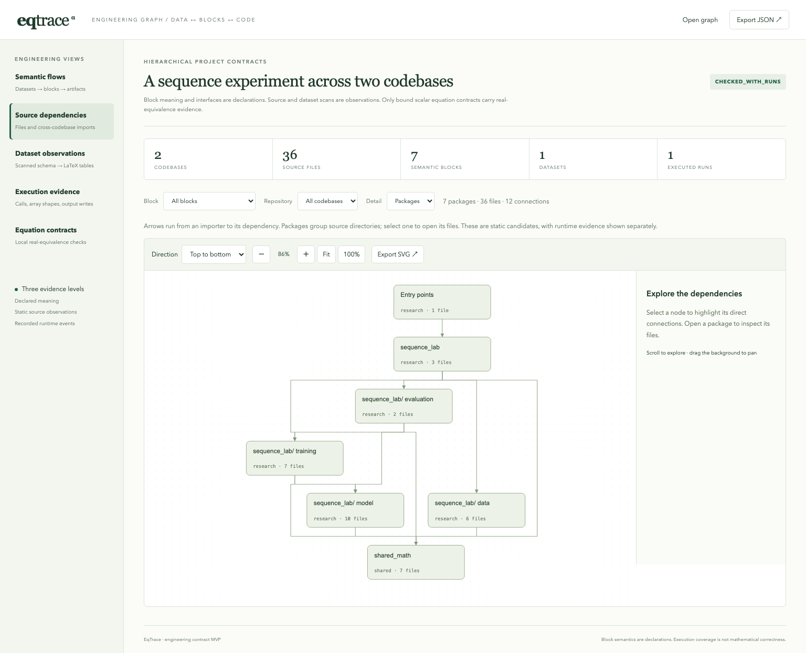
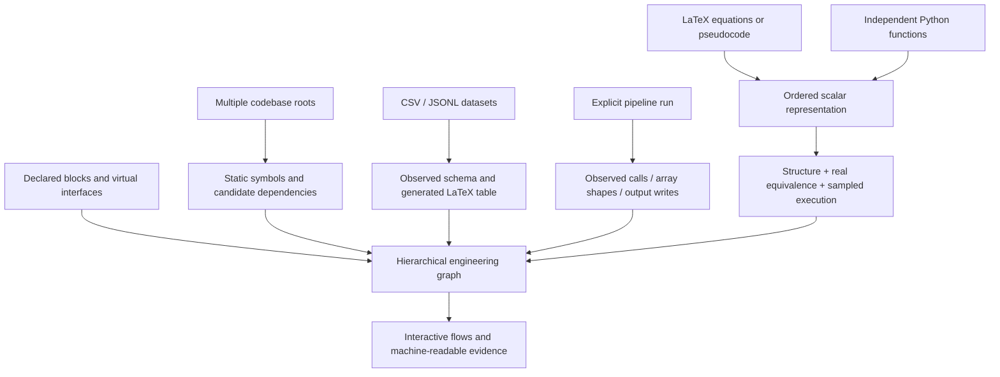

# EqTrace

**Inspectable contracts between papers, code, and execution.**

[](https://github.com/Mappedinfo/eqtrace/actions/workflows/checks.yml)
[Interactive demo](https://mappedinfo.github.io/eqtrace/) · [Technical report (PDF)](paper/eqtrace.pdf) · [LaTeX source](paper/main.tex) · [中文说明](docs/README.zh-CN.md) · [Evidence boundaries](docs/trust.md)

EqTrace connects LaTeX equations and pseudocode to executable code, then places those local contracts inside a project graph of datasets, multi-file blocks, virtual interfaces, and recorded runs. It helps review whether a change still implements the described method.



## Try the complete example

Requires Python 3.11+ and [uv](https://docs.astral.sh/uv/). From a clone of this repository:

```bash
make setup             # locked environment; Z3, NumPy demo, tests, browser tools
make test              # parser, proof, runtime, freshness, and interface checks
make demo              # actual checks and pipeline execution; export both workbenches
```

Open `artifacts/engineering/index.html` for the **36-file / 2-codebase** engineering example. Open `artifacts/equations/index.html` for formula/code comparison. These HTML files are self-contained and work offline. Committed snapshots are in [docs/demo](docs/demo); regenerate them before claiming freshness on another environment.

For live formula editing, run `make serve`, then open [the local workbench](http://127.0.0.1:8765). Changing the implementation exposes changed operations, counterexamples, and failing execution samples. The browser service only checks temporary scalar source pairs.

## What connects to what?



The graph keeps these claims separate:

| Evidence | What it supports |
|---|---|
| Declared block meaning / ports | The author's intended semantics and dataflow |
| Static observations | Current files, symbols, imports, and **candidate** calls |
| Recorded execution | Selected main-thread calls, array shapes, output-write events, and hashes |
| `PROVED_REAL` scalar leaf | Conditional real equivalence under the accepted translation and domain |
| Successful sampled comparison | Agreement on the actual executed scalar samples |

A block can contain many files across codebases, have a parent, and appear in several named flows. A virtual entity can be an in-memory tensor, checkpoint, prepared dataset, or metric record. Its shape contract binds to an explicit function argument or return value. [Engineering guide →](docs/architecture.md)

## A small equation contract

A paper equation and implementation remain independent sources:

```latex
\begin{equation}\label{eq:loss}
 e = (a-b)^2
\end{equation}
```

```python
def squared_error(a, b):
    difference = a - b
    return difference * difference
```

Bind them with a manifest:

```toml
schema_version = 1
paper_sources = ["method.tex"]

[[contracts]]
id = "loss"
label = "eq:loss"
implementation = "loss.py"
function = "squared_error"
inputs = ["a", "b"]
domains = {a = [-10, 10], b = [-10, 10]}
policy = "algebraic"
```

Run `code/.venv/bin/eqtrace check eqtrace.toml`. A strict pass requires a resolved binding, accepted domain, real-equivalence result, and successful current-source execution. `ordered` policy also requires the same ordered computation. Removing an epsilon, introducing an unmodeled fallback, or leaving a stub prevents a strict pass.

## Translation in both directions

```bash
code/.venv/bin/eqtrace translate examples/formula.txt --from latex --inputs x,mu,sigma,epsilon
code/.venv/bin/eqtrace translate examples/implementation.py --from python --function normalize
```

Each exports minimal Python, LaTeX, algorithmic pseudocode, text pseudocode, graph JSON, Mermaid, and SVG. LaTeX pseudocode uses `--from pseudocode` and an explicit input list. Translation alone is labeled **unexecuted and unproved**. Supported syntax and failure states are documented in the [equation guide](docs/equations.md).

## Check a real engineering run

```bash
code/.venv/bin/eqtrace trace examples/engineering/architecture.toml sequence-run
code/.venv/bin/eqtrace architecture examples/engineering/architecture.toml \
  --require-runs --out artifacts/engineering
```

The example reads 384 synthetic records, prepares arrays, runs a frozen attention encoder, trains and fine-tunes a regression head, and exports checkpoints, predictions, and metrics. **Only the head is optimized.** Four declared NumPy interface shapes are checked against real calls. One proven squared-error leaf is called by the prediction writer. [Example manifest →](examples/engineering/architecture.toml)

The `trace` command executes the declared project entry point with ordinary user permissions. Use it with trusted code. `architecture` scans and audits existing evidence; it does not execute the pipeline.

## Validate the tool against its own paper

`selfcheck.toml` binds two formulas and one algorithm in the report to the actual discrepancy kernels used by EqTrace. The root `architecture.toml` scans the checker itself and attaches these contracts to its checker block. This is self-application with a circular trust boundary, not verification of the checker.

The released synthetic corpus contains 18 authored cases: 4 valid and 14 invalid or unsupported. All expected classifications matched; a midpoint-only comparison accepted 4 invalid cases. These are regression results, not independent benchmark estimates. [Retained evidence →](evidence/results.json)

## Development and paper

```bash
make test
make demo
make build
make paper             # XeLaTeX + latexmk + biber + documented fonts/packages
# In another terminal, with make serve running:
code/.venv/bin/python -m playwright install chromium
make browser
```

See [build and contribution instructions](CONTRIBUTING.md), [architecture](docs/design.md), and [reference provenance](docs/references.md). The Python core has no runtime dependencies. Z3 is an explicit proof extra; NumPy is used by the engineering demo. No external AI service, Lean installation, API key, or private dataset is required.

**Current proof boundary:** scalar arithmetic in a fully consumed restricted grammar. Whole pipelines, arbitrary tensor kernels, scientific meaning, all-input floating-point behavior, and the checker itself are not proved. Unknown solver outcomes and unsupported constructs cannot become strict passes. General Python can still be inspected at the static/trace layer. [Trust model →](docs/trust.md)

MIT licensed. Please cite the accompanying [technical report](CITATION.cff). Inspired by [Prove2Me](https://prove2.me/about), [I Heart LA / HeartDown](https://iheartla.github.io/), and computation-linked visual inspection. EqTrace currently produces Z3 evidence, not Lean proof certificates.
